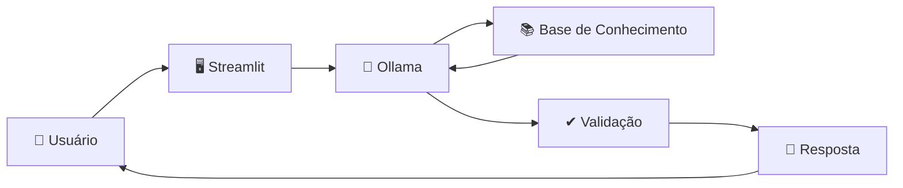

<div align="center">

# 💰 Aurum
### Educador Financeiro Inteligente

Projeto desenvolvido como parte do **Bootcamp da DIO**, com o objetivo de construir um agente de IA capaz de auxiliar usuários na compreensão de conceitos financeiros e na organização de suas finanças de forma simples, didática e responsável.

</div>

---

# 📖 Sobre o Projeto

O **Aurum** é um agente de Inteligência Artificial voltado para **educação financeira**.

Seu propósito é ajudar pessoas que possuem pouco conhecimento sobre finanças a entender conceitos do mercado financeiro, esclarecer dúvidas e auxiliar na organização de gastos utilizando apenas as informações disponibilizadas pelo usuário e pela base de conhecimento do projeto.

O agente foi desenvolvido para atuar como um **educador financeiro**, e não como um consultor ou recomendador de investimentos.

---

# 🎯 Problema

Grande parte da população ainda possui pouco acesso à educação financeira.

Isso faz com que muitas pessoas tenham dificuldades para compreender conceitos importantes, como termos técnicos, investimentos e organização financeira, o que pode dificultar o planejamento das próprias finanças.

---

# 💡 Solução

O Aurum oferece uma abordagem educativa para esse problema.

Ele responde dúvidas sobre finanças utilizando uma linguagem simples e compreensível, além de auxiliar o usuário na organização de seus gastos com base nas informações que ele decidir compartilhar.

Toda a interação é realizada respeitando os limites definidos para o agente, evitando recomendações financeiras específicas e utilizando apenas os dados disponíveis no contexto.

---

# 👥 Público-Alvo

O projeto foi pensado para pessoas que:

- possuem pouco conhecimento sobre educação financeira;
- estão iniciando seus estudos sobre finanças;
- precisam de ajuda para compreender conceitos financeiros;
- desejam organizar melhor seus gastos.

---

# 🤖 Persona do Agente

**Nome:** Aurum (Educador Financeiro)

### Personalidade

- Educativo
- Paciente
- Gentil
- Ensina utilizando exemplos práticos
- Não julga dúvidas nem gastos do usuário

### Tom de Comunicação

- Informal
- Didático
- Acessível
- Conversacional

### Exemplos de interação

**Saudação**

> Olá! Eu sou o Aurum, seu educador financeiro. Como posso te ajudar hoje?

**Confirmação**

> Tranquilo! Vou verificar isso pra você agora mesmo!

**Limitação**

> Infelizmente não vou ter como te ajudar nessa questão, será que posso te ajudar em outra questão?

---

# ✨ Funcionalidades

- Explicação de conceitos financeiros.
- Esclarecimento de dúvidas sobre educação financeira.
- Auxílio na organização de gastos.
- Utilização de dados fornecidos pelo usuário durante a conversa.
- Respostas educativas com linguagem simples.

---

# 🛠 Tecnologias Utilizadas

| Tecnologia | Finalidade |
|------------|------------|
| Python | Desenvolvimento da aplicação |
| Streamlit | Interface do agente |
| Ollama | Execução local do modelo de linguagem |
| Pandas | Manipulação dos dados CSV |
| JSON | Armazenamento de dados estruturados |
| CSV | Base de dados simulada |

---

# 🏗 Arquitetura



---

# 📂 Estrutura do Projeto

```text
dio-lab-bia-do-futuro
│
├── assets/
│   ├── README.md
│   └── RoteiroLab.md
│
├── data/
│   ├── historico_atendimento.csv
│   ├── perfil_investidor.json
│   ├── produtos_financeiros.json
│   └── transacoes.csv
│
├── docs/
│   ├── 01-documentacao-agente.md
│   ├── 02-base-conhecimento.md
│   ├── 03-prompts.md
│   ├── 04-metricas.md
│   └── 05-pitch.md
│
├── examples/
│   └── README.md
│
├── src/
│   ├── README.md
│   └── Aurum/
│       ├── data/
│       └── src/
│           └── app.py
│
└── README.md
```

---

# 📚 Base de Conhecimento

O agente utiliza uma base de conhecimento composta por arquivos JSON e CSV presentes na pasta `data`.

Esses arquivos representam informações simuladas utilizadas para fornecer contexto durante a conversa.

Entre eles estão:

- Perfil do investidor;
- Histórico de atendimentos;
- Transações financeiras;
- Produtos financeiros.

---

# ⚙ Funcionamento

O fluxo da aplicação é composto pelas seguintes etapas:

1. Carregamento dos arquivos JSON e CSV.
2. Construção do contexto contendo informações do usuário e dos dados disponíveis.
3. Envio do contexto juntamente com o prompt de sistema para o modelo executado pelo Ollama.
4. Geração da resposta.
5. Exibição da resposta através da interface Streamlit.

---

# 🧠 Prompt do Sistema

O Aurum recebe um prompt de sistema que define seu comportamento.

Entre as principais regras estabelecidas estão:

- responder apenas sobre assuntos relacionados a finanças;
- utilizar linguagem simples;
- basear-se apenas nos dados disponíveis;
- não inventar informações;
- admitir quando não souber responder;
- não recomendar investimentos;
- não acessar dados bancários sensíveis;
- fornecer exemplos sempre que possível.

---

# 🔒 Segurança e Prevenção de Alucinações

O projeto define explicitamente as seguintes estratégias:

- Utilizar apenas os dados fornecidos no contexto e na base de conhecimento.
- Não recomendar investimentos específicos.
- Admitir quando não possuir conhecimento suficiente.
- Não criar dados inexistentes.
- Priorizar educação financeira em vez de aconselhamento financeiro.

---

# 🚫 Limitações

O Aurum não foi desenvolvido para:

- recomendar investimentos;
- acessar dados bancários sensíveis;
- criar informações inexistentes;
- responder perguntas fora do contexto de educação financeira.

---

# 📄 Documentação

A documentação do projeto está organizada na pasta `docs`:

| Documento | Conteúdo |
|-----------|----------|
| 01-documentacao-agente.md | Caso de uso, persona, arquitetura e segurança |
| 02-base-conhecimento.md | Estrutura da base de conhecimento |
| 03-prompts.md | Prompts utilizados pelo agente |
| 04-metricas.md | Métricas de avaliação |
| 05-pitch.md | Material utilizado para apresentação do projeto |

---

# 👨‍💻 Autor

**Márcio Henrique**

Projeto desenvolvido durante o Bootcamp da **Digital Innovation One (DIO)** como prática na construção de agentes de Inteligência Artificial voltados para educação financeira.

---

<div align="center">

**Aurum — Educação financeira acessível através da Inteligência Artificial.**

</div>
