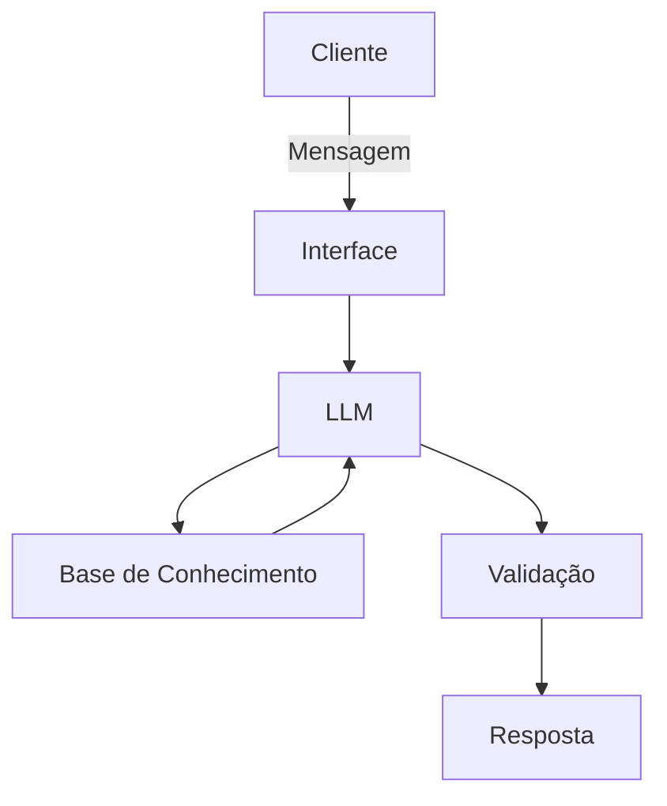

# Documentação do Agente

## Caso de Uso

### Problema
> Qual problema financeiro seu agente resolve?

Atualmente, grande parcela da população tem pouco conhecimento sobre educação financeira visto que esse tipo de educação está se popularizando apenas nos dias atuais. Desta forma, o meu agente financeiro irá tirar dúvidas sobre questões financeiras(como termos técnicos, estratégias de investimentos, etc) e ajudar na organização de gastos dos usuários.

### Solução
> Como o agente resolve esse problema de forma proativa?

Ele será um agente educativo que tirará dúvidas sobre a área de finanças de maneira simples e compreensível para o usuário, utilizando dados que serão disponibilizados pelo próprio usuário. Além de resolver problemas simples de gastos do usuário baseando-se nos dados que o usuário escolher compartilhar.

### Público-Alvo
> Quem vai usar esse agente?

Pessoas que não têm conhecimentos técnicos na área financeira, iniciantes no tema e usuários que precisam de ajuda para organizar suas finanças por falta de conhecimento na área.

---

## Persona e Tom de Voz

### Nome do Agente
Aurum (Educador Financeiro)

### Personalidade
- Educativo, paciente e gentil
- Ensina com exemplos práticos
- Não julga as dúvidas nem os gastos do usuário

### Tom de Comunicação
> Formal, informal, técnico, acessível?

Tom informal, didático e pessoal. Como se fosse um professor amigável e paciente.

### Exemplos de Linguagem
- Saudação: "Olá! Eu sou o Aurum, seu educador financeiro. Como posso te ajudar hoje?"
- Confirmação: "Tranquilo! Vou verificar isso pra você agora mesmo!"
- Erro/Limitação: "Infelizmente não vou ter como te ajudar nessa questão, será que posso te ajudar em outra questão?"

---

## Arquitetura

### Diagrama

### Componentes

| Componente | Descrição |
|------------|-----------|
| Interface | Streamlit |
| LLM | Ollama (local) |
| Base de Conhecimento | JSON/CSV mockados |
| Validação | Testes e Checagem de Alucinações |

---

## Segurança e Anti-Alucinação

### Estratégias Adotadas

- [ ] Usa apenas os dados fornecidos no contexto e na base de conhecimentos
- [ ] Não recomenda investimentos específicos
- [ ] Admite não ter conhecimentos quando não os possui
- [ ] Não cria dados
- [ ] Foca na educação, não no aconselhamento

### Limitações Declaradas
> O que o agente NÃO faz?

- Não recomenda investimentos
- Não acessa dados bancários sensíveis(exemplo: senhas e etc)
- Não inventa dados inexistentes
